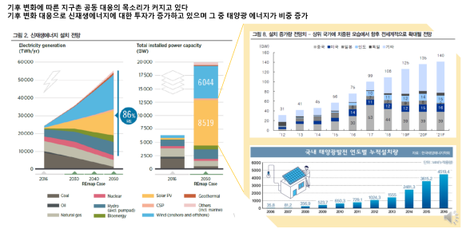
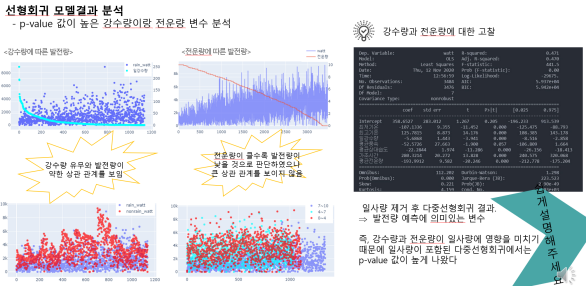
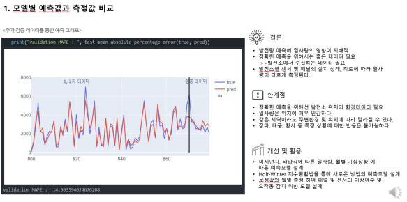

  <h1 align="center">Solar Power Forecasting</h1>
  <h3 align="center">광주인공지능사관학교 기업프로젝트 - 태양광발전량예측모델개발</h3>
  <h3 align="center">
    <a href="http://www.enitt.co.kr/">ENITT (주) 에니트</a>
  </h3>
  <h4 align="center">개발 목적</h4>
  
  기후 변화에 따른 지구촌 공동 대응의 목소리가 커지고 있는 가운데 기후 변화 대응으로 신재생 에너지에 대한 투자가 증가하고 있으며 그중 태양광 에니 비중이 크게 증가함
  
  <h4 align="center">데이터</h4>
  

  
  - ENITT 태양광 발전소 데이터
  - 기상청 기후 데이터(기온, 강수량, 풍속, 습도, 일조시간, 일사량, 전운량, 지면온도)
  - ENITT 태양광 발전소 기상정보 (경사 일사량, 수직 일사량, 온도, 습도)
  
  

    
    <h4 align="center">분석과정</h4>
  

  
  
 1. 기업데이터 확인 및 전처리
    - 필요 파라미터 선별 : 기업데이터 중 시간 발전량, 일사량 선별
    - 비정상 데이터 처리 : 특정 시기에 태양광 발전량 센서의 미작동으로 인한 데이터 결함은 0으로 처리
    - 초단위의 데이터를 시간단위 데이터로 전처리
    - 예측 시간 설정 : 발전이 되는 9~17시를 기준으로 얘측 모델 설계
    - 단위 변환 : 설비용량에 따른 발전량의 차이를 없애기 위해 용량당 발전량으로 변환 (watt/ pow_cap  (pow_cap : 설비용량))
 
 2. 데이터 분석
    - 발전량과 환경변수 사이의 상관계수 도출 : 발전량과 일사량은 대략 0.855 ~ 0.9802 사이의 강한 상관관계를 보임, 다중 공선성의 문제를 해결하기 위해 경사 일사량만을 사용
    - 기업의 일사량과 기상청의 일사량 데이터의 MAPE 검토 : 기상청 데이터를 활요하기 위해서는 기상청 데이터와 기업의 환경데이터가 유사하다는 전제조건이 필요 하지만, 상관ㄱ수대비 MAPE가 너무 높다는 결론 도출
    - 시간별 기준시 MAPE 높은 원인 검토 및 데이터 보정 : 시간에 따른 기업과 기상청의 일사량 데이터의 그래프 차이를 확인하고 시간대별 보정값을 통해 MAPE차이를 줄임
    - EDA를 통한 데이터 전처리및 데이터 셋 확보 : 보정값을 통한 일사량 재설정 => 14개의 발전소에 12개월 동안 9~17시 의 태양광 발전량 데이터 확보
 
 3. 모델링 훈련 및 결과
    - LinearRegression => R-squared : 0.812
    - Gradient Boosgin => R-squared : 0.887
    - RandomForest => R-squared : 0.978
    
    - 강수량 유무와 발전량은 약한 상관관계를 보이고 전운량과 발전량은 큰상관계수를 보이지 않은 이는 일사량이 발전량에 큰 영향을 미쳐 두가지의 환경변수가 상대적으로 약한 상관관계를 보이는것으로 확인됨
  
  

    <h4 align="center">예측결과</h4>
    
  

  
  
  
